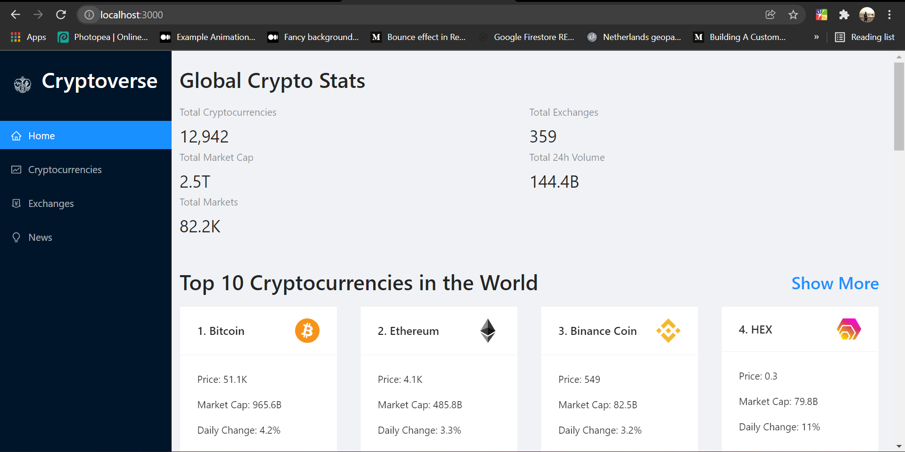

## Cryptoverse

A React based website for cryptocurrencies. A static website build with React.js to build up skills in React UI.
It also has a backend API integration.

## Preview Shots
###### Home Page

###### News Page

## Tools Used
* React for front end
* API Integration

## How to Run
1. Clone this repository into your local computer.
2. Make sure you have node installed.
3. Run following command to install packages in **frontend/**.
 > npm install 
4. Start frontend react server with the same command
> npm start
5. You should see the **Home** page once the server is started.

Follow me on [LinkedIn](https://www.linkedin.com/in/utkarsh-kore-175080174/)
Thanks, Happy Coding!